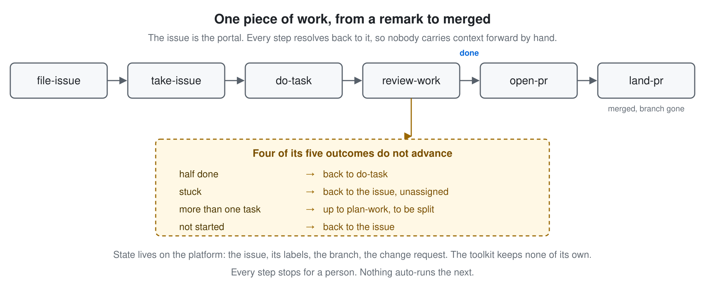
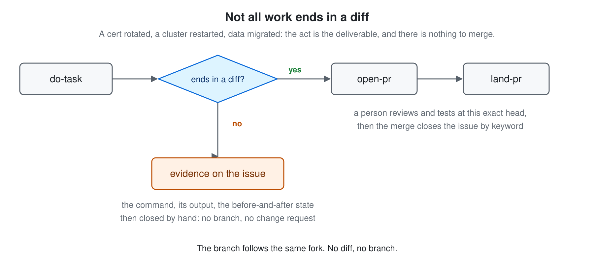
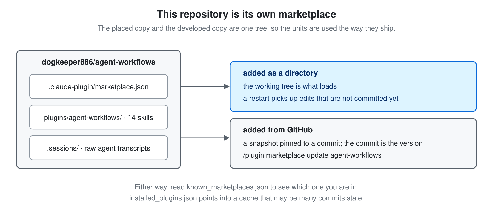

# agent-workflows

A Claude Code plugin that carries one piece of work from a remark in a session to merged:
file the issue, claim it, do the work, judge what state it actually reached, open the
change request, land it. Six skills make that spine, each stopping for a person. Eight more
plan it, gate what it produces, and clean up after it. Nothing auto-runs the next.

## Requirements

- [Claude Code](https://code.claude.com/docs) with plugin support
- `gh` or `glab`, installed and authenticated. Every step that touches an issue or a change
  request goes through one of them, and the skills derive which from `git remote`

## Install

    /plugin marketplace add dogkeeper886/agent-workflows
    /plugin install agent-workflows@agent-workflows

## Using it

Ask for what you want in your own words, or invoke a skill by name:

    /agent-workflows:file-issue the parser drops trailing commas
    /agent-workflows:take-issue 42

The namespaced form always reaches the installed skill. A bare `/file-issue` reaches a local
copy of that name when your project has one.

## How it works

The issue is the portal. When you say *"merge it"* you say nothing about the issue, the
branch, or what was discussed three days ago — `land-pr` walks back from the change request
to the issue to the branch. Without that join every step would need you to carry context
forward, which is the drift this exists to remove.

**`review-work` is the reason the chain is worth having.** A step that always advanced
would be a formality. Four of its five outcomes send the work somewhere other than a change
request, and those four — half done, stuck, two tasks under one number, never started — are
the states that otherwise go unrecorded.

**The toolkit keeps no state of its own.** No story file, no plan file, no index. The
issue, its labels, the branch and the change request live on the platform, which is the one
place both a person and an agent can read.

## Not all work ends in a diff

A cert rotated, a cluster restarted, data migrated: the act is the deliverable. `do-task`
performs it, records the command, its output and the before-and-after state on the issue,
and closes it. No branch is cut, and no change request is ever opened. That is also why
`take-issue` cuts a branch only when a diff is coming.

`file-issue` carries the same fork upstream, with a template per kind:
[bug](plugins/agent-workflows/skills/file-issue/templates/bug.md) ·
[task](plugins/agent-workflows/skills/file-issue/templates/task.md) ·
[docs](plugins/agent-workflows/skills/file-issue/templates/docs.md) ·
[environment](plugins/agent-workflows/skills/file-issue/templates/environment.md) ·
[operation](plugins/agent-workflows/skills/file-issue/templates/operation.md).

## The skills

### The spine

| Skill | What it does |
|---|---|
| [file-issue](plugins/agent-workflows/skills/file-issue/SKILL.md) | Turns something said in a session into an issue a cold agent can act on, and copies the session log beside it |
| [take-issue](plugins/agent-workflows/skills/take-issue/SKILL.md) | Reads the issue whole, refuses it back when it cannot be started, or claims it and stops before any work |
| [do-task](plugins/agent-workflows/skills/do-task/SKILL.md) | Writes and commits the change, or performs the act and captures the evidence |
| [review-work](plugins/agent-workflows/skills/review-work/SKILL.md) | Judges which of five states the work reached, and routes it there |
| [open-pr](plugins/agent-workflows/skills/open-pr/SKILL.md) | Pushes the branch and opens the change request, linked so the issue closes on merge |
| [land-pr](plugins/agent-workflows/skills/land-pr/SKILL.md) | Merges at a pinned SHA after a person answers whether they reviewed and tested it, then cleans up |

### Around it

| Skill | What it does |
|---|---|
| [plan-work](plugins/agent-workflows/skills/plan-work/SKILL.md) | Splits work too large for one issue, grouped with whatever the platform already provides |
| [gen-readme](plugins/agent-workflows/skills/gen-readme/SKILL.md) | Writes a README from the code, with one rendered diagram per key point |
| [review-readme](plugins/agent-workflows/skills/review-readme/SKILL.md) | Gates a README on three counts: useful to a newcomer, true to the code, and readable |
| [reviewing-artifacts](plugins/agent-workflows/skills/reviewing-artifacts/SKILL.md) | Gates the files an agent reads: skills, commands, rules. Returns PASS, REVISE or CUT |
| [reviewing-phrasing](plugins/agent-workflows/skills/reviewing-phrasing/SKILL.md) | Reviews the words of a human-read document, greping the mechanical tells first |
| [reviewing-typography](plugins/agent-workflows/skills/reviewing-typography/SKILL.md) | Reviews how such a document looks, the way a UI designer would |
| [reporting-outcomes](plugins/agent-workflows/skills/reporting-outcomes/SKILL.md) | Holds every reply to two lines and a question: the verdict, the next step, the offer |
| [remove-stale-files](plugins/agent-workflows/skills/remove-stale-files/SKILL.md) | Deletes what earlier versions of this plugin left behind, and the forks that shadow it |

## This repo is its own marketplace

The skills are developed in the same tree that serves them, so they are used the way they
ship. If you are working on the plugin, add this directory as the marketplace source and
restart the session to load an edit — including one you have not committed yet.

## Session logs

`.sessions/` holds the raw agent transcripts, copied byte for byte out of
`~/.claude/projects/`, unfiltered. A log informs; it never binds. The code binds on what is
true now, the issue binds on what a change may touch, and a log that seems to forbid
something is only a previous session's situation.

## Contributing

`reviewing-artifacts` gates a skill, `reviewing-phrasing` and `reviewing-typography` gate a
document. By convention both are run on this repo's own files before they land; nothing
enforces it. Diagrams are SVG sources committed alongside PNGs rendered by an explicit
command, `rsvg-convert` by default:

    rsvg-convert -z 2 docs/diagrams/<name>.svg -o docs/diagrams/png/<name>.png

Renaming a skill leaves citations behind in the other thirteen, in both manifests and in
this file. Check them before opening a change request:

    scripts/check-names.sh

## License

MIT, as declared in
[plugin.json](plugins/agent-workflows/.claude-plugin/plugin.json).
