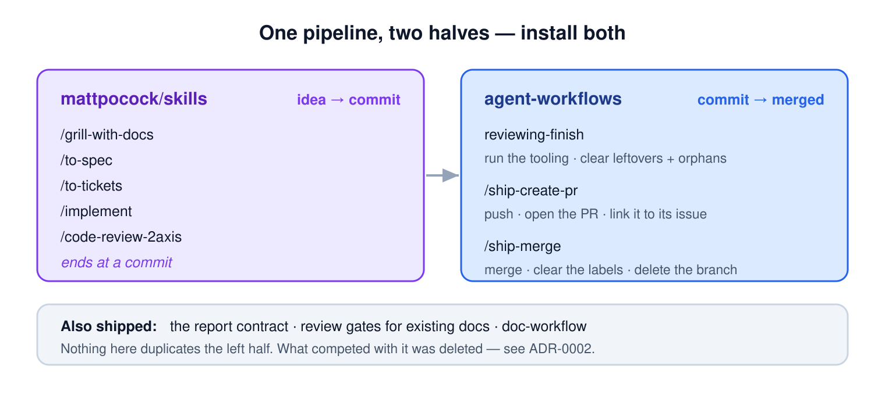
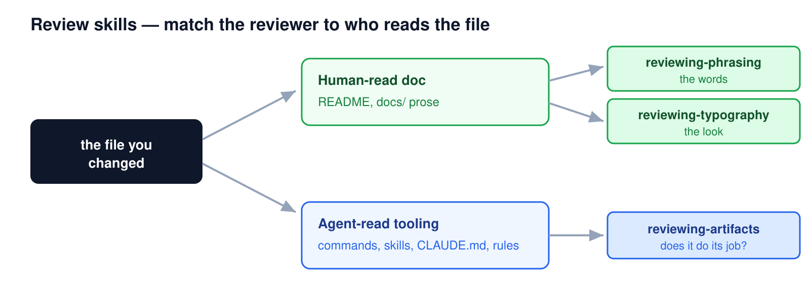
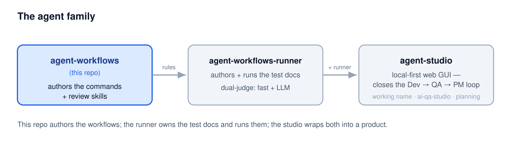

# agent-workflows

**The layer wrapped around [`mattpocock/skills`](https://github.com/mattpocock/skills).** His set carries an idea to a commit — `/grill-with-docs`, `/to-spec`, `/to-tickets`, `/implement`, `/code-review-2axis` — and stops there. This plugin carries it the rest of the way, and adds the checks his diff-reading review cannot make.

These two are **complements, not alternatives**. Install both.



## Contents

- [What this adds](#what-this-adds)
- [Getting started](#getting-started)
- [Usage](#usage)
- [Available commands](#available-commands)
- [Skills](#skills)
- [Project structure](#project-structure)
- [The agent family](#the-agent-family)
- [License](#license)

## What this adds

Four things his set does not reach.

**The ship tail.** `/implement` ends at *"commit your work to the current branch"* — nothing pushes, opens a change request, or merges. `ship-create-pr` pushes and opens the PR already linked to its issue; `ship-merge` merges, clears the labels, deletes the branch, and puts you back on the default branch. `/triage` applies a `ready-for-agent` state and nothing upstream ever clears it — the merge step is that label's only exit.

**The finish review.** `/code-review-2axis` reads the diff. It cannot run your build, and it does not look for the debris a change leaves behind. `reviewing-finish` runs the project's own tooling, sweeps the debug prints and commented-out blocks and stray TODOs, and removes the imports and files *your* change orphaned. It runs **after** the two-axis review, never instead of it.

**The report contract.** A reply that blends what was done, what is suspected, what was skipped on purpose and what is still uncertain into one paragraph is unreadable at exactly the moment it matters. `rules/agent-report.md` keeps those parts distinct — bound from your project's `CLAUDE.md`, so it holds even when the agent is the one producing the mess.

**Review gates for existing documents.** His writing skills generate prose; none of them judges a document that already exists. `reviewing-phrasing`, `reviewing-typography`, and `reviewing-artifacts` do — and `doc-gen-readme` / `doc-review-readme` are a README author and its accuracy gate.

Looking for the QA half — planning what to test, writing the test docs, binding them to what runs? That lives in [`agent-workflows-runner`](https://github.com/dogkeeper886/agent-workflows-runner), which owns authoring and execution together.

## Getting started

Two separate things, and only one of them repeats.

### Placement — once, for all projects

Both plugins. This one is its own marketplace; nothing to clone, no build step:

```
/plugin marketplace add dogkeeper886/agent-workflows
/plugin install agent-workflows@agent-workflows
```

Then install [`mattpocock/skills`](https://github.com/mattpocock/skills) for the front half, following its own instructions. Restart your IDE and both sets are there. `/plugin update agent-workflows@agent-workflows` moves every project at once — there is no per-project copy to go stale behind you.

The commands drive your host's CLI — [`gh`](https://cli.github.com/) for GitHub, [`glab`](https://gitlab.com/gitlab-org/cli) for GitLab — worked out from the repo's git remote. Make sure the one you need is authenticated.

### Adoption — once per project

The placed commands don't know what *your* project is. Each repo says so in one file:

```
mkdir -p .claude/rules && curl -o .claude/rules/project-profile.md \
  https://raw.githubusercontent.com/dogkeeper886/agent-workflows/main/.claude/rules/project-profile.md
```

Then edit it. What it declares:

- where test docs and diagrams live, and how they're numbered
- label names — including the triage state `ship-merge` clears
- the branch-name pattern, the closure keyword, and the merge strategy
- test-doc front matter and how staleness is detected
- the change-request noun your host uses — `PR` or `MR`
- the verdict words a review reports in

Everything a command would otherwise hardcode resolves from this file — you adapt the workflow here, never the units. The shipped values reproduce this repo's own behaviour, so changing nothing is safe.

A repo that declares nothing **stops and says so**. There is deliberately no fallback to a global profile: a silent one would run another project's conventions with nothing in the session to reveal it.

Finally, copy [`templates/CLAUDE.md`](templates/CLAUDE.md) into your repo — it is what binds the report contract to every session.

## Usage

Drive a change from idea to merged. The first five steps are Matt's; the last three are this plugin's:

```
/grill-with-docs   Add cross-repo sync   # interview the idea until it holds up
/to-spec                                 # publish the agreed need as a spec issue
/to-tickets                              # decompose it, with blocking edges declared
/implement         27                    # build it, ending at a commit
/code-review-2axis                       # the diff, against standards and spec
                                         # ── the handoff ──
reviewing-finish                         # run the tooling; clear leftovers and orphans
/ship-create-pr    27                    # push, open the PR, link it (Fixes #27)
                                         # ── a human reviews and tests ──
/ship-merge        30                    # merge, clear the labels, delete the branch
```

## Available commands

All of them live in [`plugins/agent-workflows/commands/`](plugins/agent-workflows/commands/).

| Group | Commands | Job |
|-------|----------|-----|
| **Ship tail** | `ship-create-pr` · `ship-merge` | commit → merged, with the branch and labels cleaned up |
| **Doc workflow** | `doc-gen-readme` · `doc-review-readme` | a codebase → its README, and the accuracy gate |

## Skills

Shipped in the plugin alongside the commands. All are invoked by hand.

**`reviewing-finish`** is the pass after `/code-review-2axis`: it runs the project's tooling so "verified" means observed, sweeps leftovers, removes the orphans your change created, and ends in a verdict that routes somewhere.

**The review skills (`reviewing-*`)** judge finished work by judgment, not a scored checklist — a minimum bar, not an exhaustive one.



**`reporting-outcomes`** shapes the reply an agent writes when it reports back in chat — the turn carrying progress, a verdict, reasons and a status at once. `agent-report.md` binds what a *command* prints at a gate; this puts the same shape on the conversational report-back.

## Project structure

```
agent-workflows/
├── .claude-plugin/
│   └── marketplace.json   # This repo is its own marketplace
├── plugins/agent-workflows/   # The shipped plugin — placed once, reaching every project
│   ├── commands/          # ship-* (ship tail), doc-* (README authoring)
│   ├── skills/            # reviewing-* + reporting-outcomes
│   └── rules/             # Doctrine: the pipelines, the report contract, anti-slop, profile-doctrine
├── .claude/rules/
│   └── project-profile.md # This project's values — the one file adoption touches
├── templates/             # CLAUDE.md for projects adopting these workflows
├── docs/
│   ├── adr/               # Architecture decisions (ADR-*)
│   └── stories/           # Historical story records (no command writes these now)
├── CLAUDE.md              # Behavioral guidelines + workflow discipline for the agent
└── README.md
```

## The agent family

This repo is the **`agent-workflows`** layer. Two sibling repos complete the picture:



| Repo | Role | Status |
|------|------|--------|
| **agent-workflows** (this repo) | the ship tail, the review skills, and the doc workflow | — |
| [**agent-workflows-runner**](https://github.com/dogkeeper886/agent-workflows-runner) | the whole QA half — planning what to test, writing the test docs, binding them, and running them under a dual judge (fast checks + opt-in LLM judge) | shipped |
| **agent-studio** | local-first web GUI over the workflows + runner; closes the Dev → QA → PM loop | working name (currently `ai-qa-studio`), planning |

## License

MIT
