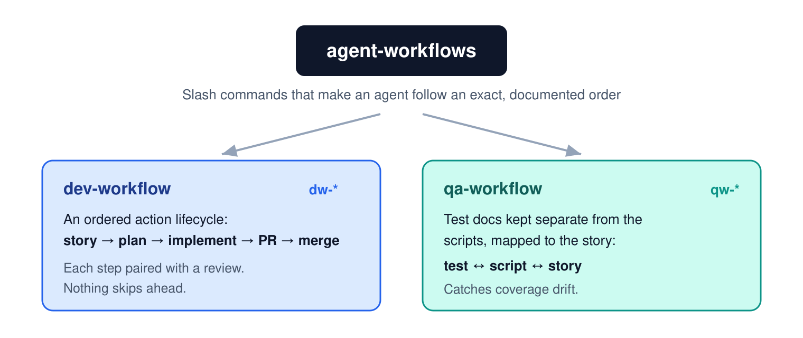
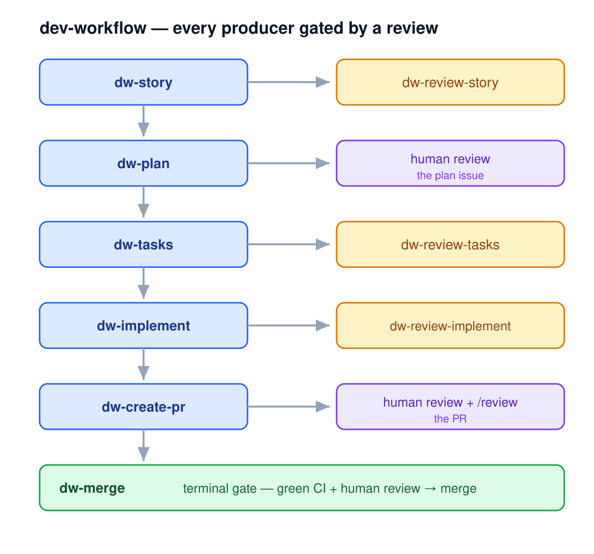
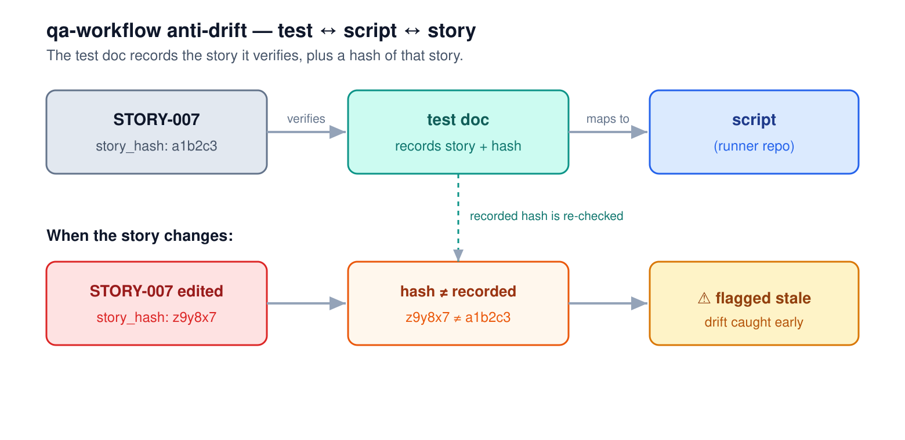
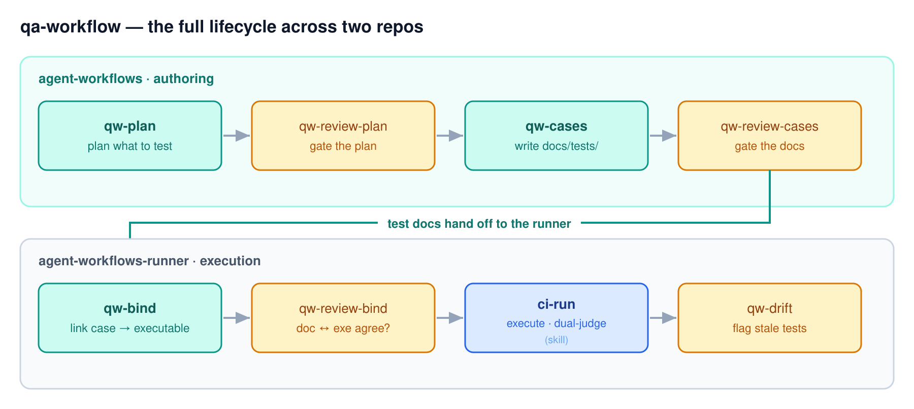

# agent-workflows

Slash commands that make an AI coding agent follow an **exact, documented order** — driven by GitHub issues and the story files in the repo. Two workflows live in `.claude/commands/`:

- **dev-workflow** (`dw-*`) — turn a need into shipped work through an ordered lifecycle: story → plan → tasks → implement → PR → merge. Each step is paired with a review; nothing skips ahead. The lifecycle is general — it disciplines any ordered action, not just code.
- **qa-workflow** (`qw-*`) — author test **docs** kept *separate* from the test scripts, each mapped to the story it verifies (**test ↔ script ↔ story**). Splitting the doc from the script means coverage isn't silently lost as the code changes across cycles.



## Contents

- [Why two workflows](#why-two-workflows)
- [Installation](#installation)
- [Usage](#usage)
- [Available commands](#available-commands)
- [Review skills](#review-skills)
- [Project structure](#project-structure)
- [The agent family](#the-agent-family)
- [License](#license)

## Why two workflows

**dev-workflow is the discipline.** An agent that follows the order instead of improvising — every change flows from a single GitHub issue (the source of truth), and a human gate sits between each step, so nothing runs ahead of your review.



**qa-workflow is the anti-drift layer.** A test is a markdown **doc** (what to verify, mapped to a story); the **script** that runs it lives in the runner repo. The doc records its `story` + `story_hash`, so when the story changes the hash no longer matches and the test is flagged stale — drift is caught instead of quietly accumulating. Authoring is self-contained (markdown + GitHub); executing the scripts is the runner's job — see [the agent family](#the-agent-family).



## Installation

No installer, no build step. The workflows are plain markdown files under `.claude/`; you install them by copying the ones you want into your project's `.claude/` directory.

```
git clone https://github.com/dogkeeper886/agent-workflows

# copy the commands, review skills, and workflow rules into your repo
cp -r agent-workflows/.claude/commands/dev-workflow  your-repo/.claude/commands/
cp -r agent-workflows/.claude/commands/qa-workflow   your-repo/.claude/commands/
cp -r agent-workflows/.claude/commands/doc-workflow  your-repo/.claude/commands/
cp -r agent-workflows/.claude/skills/*               your-repo/.claude/skills/
cp -r agent-workflows/.claude/rules/*                your-repo/.claude/rules/
```

Restart your IDE to load the new commands. The `dw-*` / `qw-*` commands run on the `gh` CLI — make sure [`gh`](https://cli.github.com/) is installed and authenticated (`gh auth status`).

> The `rules/` files (`dev-workflow.md`, `qa-workflow.md`, `doc-workflow.md`) carry the full pipeline and the producer→review pairing; `agent-report.md` states what a command reports back at a gate; `project-profile.md` holds your project's paths, IDs, labels, and conventions. Copy them alongside the commands, or the commands' references to them will dangle.

**Customize for your repo:** edit `.claude/rules/project-profile.md` — the one place for paths, ID schemes, labels, branch/merge conventions, front-matter, and review semantics (live integrations, canonical format, audience). The commands and skills read their values from it, so you adapt the workflow there instead of editing the units. The shipped defaults match this repo's behaviour, so changing nothing is safe.

## Usage

Drive a change from need to merge through the dev-workflow pipeline — each step suggests the next, none auto-runs it:

```
/dw-story    Add cross-repo sync     # capture the need as docs/stories/STORY-XXX.md
/dw-plan     STORY-007               # research → one GitHub plan issue (the approach)
/dw-tasks    STORY-007               # break the plan into task issues
/dw-implement 27                     # branch issue-27-<slug>, implement, commit
/dw-create-pr 27                     # push the branch, open the PR (Closes #27)
/dw-merge    27                      # merge, close the issue, clean up
```

Each producer has a paired review gate — `dw-review-story`, `dw-review-tasks`, `dw-review-implement` — run between the steps above. The full flow lives in [`.claude/rules/dev-workflow.md`](.claude/rules/dev-workflow.md).

The qa-workflow turns a story into test docs the same gated way:

```
/qw-plan         STORY-007           # plan what to test
/qw-review-plan  STORY-007           # gate the plan
/qw-cases        STORY-007           # write the test docs in docs/tests/
/qw-review-cases STORY-007           # gate the docs
```

The full qa lifecycle spans two repos — this repo authors the docs; the runner binds and runs them:



## Available commands

### [Dev Workflow (`dw-*`)](.claude/commands/dev-workflow/)

Issue-driven lifecycle: capture, plan, implement, review, ship.

`dw-story` · `dw-review-story` · `dw-plan` · `dw-tasks` · `dw-review-tasks` · `dw-implement` · `dw-review-implement` · `dw-create-pr` · `dw-merge`

### [QA Workflow (`qw-*`)](.claude/commands/qa-workflow/)

Test-doc authoring, each producer paired with a review.

`qw-plan` · `qw-review-plan` · `qw-cases` · `qw-review-cases`

## Review skills

Project-local skills in `.claude/skills/`. They review by judgment, not a scored checklist — a minimum bar, not an exhaustive one. Invoke them by hand.


## Project structure

```
agent-workflows/
├── .claude/
│   ├── commands/
│   │   ├── dev-workflow/   # Dev lifecycle commands (dw-*)
│   │   ├── qa-workflow/    # Test-doc authoring commands (qw-*)
│   │   └── doc-workflow/   # README authoring commands (doc-*)
│   ├── skills/             # Review skills (reviewing-*)
│   └── rules/              # The pipelines, the report contract, project-profile
├── templates/             # Sample CLAUDE.md for projects adopting these workflows
├── docs/
│   ├── stories/           # User stories (STORY-*)
│   └── tests/             # qa-workflow test-doc output
├── CLAUDE.md              # Behavioral guidelines + workflow discipline for the agent
└── README.md
```

## The agent family

This repo is the **`agent-workflows`** layer — the commands and the test docs they author. Two sibling repos complete the picture:


| Repo | Role | Status |
|------|------|--------|
| **agent-workflows** (this repo) | dev-workflow + qa-workflow commands and the test docs they author | — |
| [**agent-workflows-runner**](https://github.com/dogkeeper886/agent-workflows-runner) | executes the test scripts the qa-workflow docs map to — a dual-judge framework (fast checks + opt-in LLM judge) | shipped |
| **agent-studio** | local-first web GUI over the workflows + runner; closes the Dev → QA → PM loop | working name (currently `ai-qa-studio`), planning |

## License

MIT
